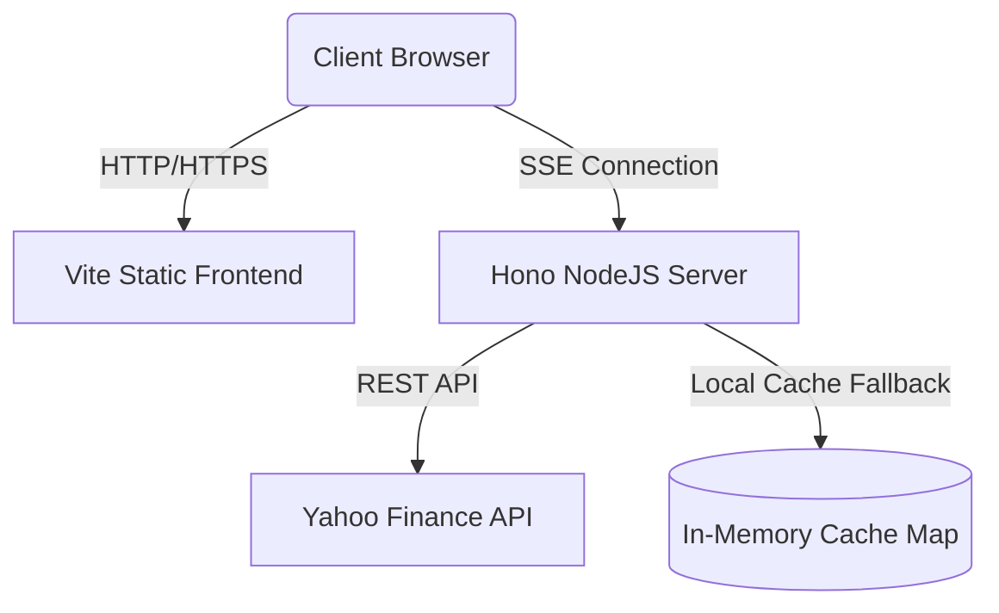

# Precious Metals Tracker Deployment Guide

This document provides step-by-step instructions to compile, configure, and deploy both the Hono backend streaming server and the React Vite frontend application in production.

---

## System Architecture



---

## 1. Backend Deployment (Hono Node Server)

The Hono server is built with Node.js and TypeScript. It communicates with Yahoo Finance, manages an in-memory fallback cache, and streams quotes using Server-Sent Events (SSE).

### Prerequisites
*   Node.js (v18 or higher)
*   NPM or Yarn

### Development & Build Commands
1. Install dependencies:
   ```bash
   npm install
   ```
2. Build the TypeScript server code (if required, though `tsx` is used for running/testing):
   ```bash
   npm run build
   ```

### Environment Variables
No specific variables are required for the backend by default, but it will automatically read the dynamic `PORT` assignment in production.

### Hosting Options
You can host the Hono server on any platform that supports Node.js application hosting (virtual machines or containers):

#### Option A: Render or Heroku (PaaS)
1. Link your GitHub repository.
2. Select **Web Service** or **NodeJS App**.
3. Set the **Build Command** to: `npm install`
4. Set the **Start Command** to: `npx tsx server.ts`
5. The cloud provider will automatically inject a production port under `process.env.PORT`.

#### Option B: PM2 on an Ubuntu Server (VPS/AWS EC2)
1. SSH into your VPS.
2. Clone the repository and install dependencies: `npm install`
3. Install PM2 globally:
   ```bash
   npm install -g pm2
   ```
4. Start the server daemon:
   ```bash
   pm2 start npx --name "metals-backend" -- tsx server.ts
   ```
5. Save the PM2 process list:
   ```bash
   pm2 save
   ```

#### Option C: Cloudflare Tunnel (Secure Expose)
If you run the Node Hono backend on a private server or VPS and want to prevent opening public inbound firewall ports (like `3000`), route requests securely through a Cloudflare Tunnel:
1. In your Cloudflare Dashboard, go to **Zero Trust** > **Networks** > **Tunnels** > **Create a Tunnel**.
2. Install the `cloudflared` daemon on your host server using the commands shown.
3. Configure the public hostname routes in the Cloudflare dashboard:
   *   **Subdomain**: `api` (e.g. `api.yourdomain.com`)
   *   **Service Type**: `HTTP`
   *   **URL**: `localhost:3000`
4. Save the tunnel. Cloudflare will automatically route requests from `https://api.yourdomain.com` securely to your local Hono port `3000` without exposing any ports publicly.

#### Option D: Cloudflare Workers (Serverless Hosting)
Since the Hono application structure exports `app` natively, you can deploy it directly as a Cloudflare Worker:
1. Install Wrangler (Cloudflare's developer CLI) in your project:
   ```bash
   npm install --save-dev wrangler
   ```
2. Create a `wrangler.toml` configuration file in the project root:
   ```toml
   name = "yfinlib"
   main = "../server.ts"
   compatibility_date = "2024-03-01"
   compatibility_flags = [ "nodejs_compat" ]
   ```
   > [!NOTE]
   > The `nodejs_compat` compatibility flag is required because the backend's `yahoo-finance2` library relies on some Node-specific classes and structures.
3. Deploy the worker to your Cloudflare account:
   ```bash
   npx wrangler deploy
   ```

---

## 2. Frontend Deployment (React Vite App)

The frontend is a static single-page application (SPA) that compiles down to plain HTML, CSS, and JS files.

### Configuration (`.env`)
Before building the frontend, configure your production variables inside your environment settings or a `.env.production` file:

```ini
# Production URL of your Hono backend server
VITE_HONO_SERVER_URL=https://api.yourdomain.com

# Production Google Analytics measurement ID
VITE_GOOGLE_TAG_ID=G-XXXXXXXXXX
```

> [!IMPORTANT]
> Vite embeds environment variables *at build time*. If you change these variables, you **must recompile** the static bundle.

### Build Compilation
Run the production compiler:
```bash
npm run build
```
This output is saved to the `/dist` directory.

### Hosting Options
The contents of the `/dist` folder can be hosted on any static hosting provider:

#### Option A: Vercel or Netlify (Recommended)
1. Connect your repository to Vercel or Netlify.
2. Set the build parameters:
   *   **Framework Preset**: Vite / Create React App
   *   **Build Command**: `npm run build`
   *   **Output Directory**: `dist`
3. Add your production environment variables (e.g. `VITE_HONO_SERVER_URL` and `VITE_GOOGLE_TAG_ID`) in their dashboard.
4. Click **Deploy**.

#### Option B: AWS S3 + CloudFront
1. Create a public S3 Bucket and enable **Static Website Hosting**.
2. Sync the `/dist` directory files:
   ```bash
   aws s3 sync dist/ s3://your-bucket-name --delete
   ```
3. Set up an AWS CloudFront CDN distribution pointing to your S3 bucket website endpoint for SSL (HTTPS) certificate support.

#### Option C: Cloudflare Pages
1. Log in to your Cloudflare Dashboard and navigate to **Workers & Pages** > **Pages** > **Create a project** > **Connect to Git**.
2. Select your repository.
3. Configure the build parameters:
   *   **Framework Preset**: `Vite`
   *   **Build Command**: `npm run build`
   *   **Build Output Directory**: `dist`
4. Expand the **Environment Variables** section and add:
   *   `VITE_HONO_SERVER_URL`: Your backend api endpoint.
   *   `VITE_GOOGLE_TAG_ID`: Your Google Analytics Tag ID.
5. Click **Save and Deploy**.

---

## 3. Post-Deployment Verification Checklist

- [ ] **HTTPS Mixed Content**: Verify both frontend and backend are hosted on secure HTTPS. Browsers will block SSE connections if you try to request an `http://` backend from an `https://` frontend.
- [ ] **CORS Settings**: If frontend and backend are on different subdomains, ensure the Hono backend has CORS enabled (implemented natively in `server.ts`).
- [ ] **Google Analytics Tracking**: Verify in Google Tag Manager real-time logs that events are registering using the configured Tag ID.
